# 知识库关系图谱

> **最后更新**: 2026-04-08  
> **Godot 版本**: 4.x  
> **知识库版本**: 1.13

---

## 📊 整体架构图

```mermaid
graph TB
    subgraph "Layer 3: Architecture 系统层"
        A[架构索引 index.md]
        B[操作日志 log.md]
    end

    subgraph "Layer 2: Wiki 知识整合层"
        C[实体页面 entities/]
        D[概念页面 concepts/]
        E[指南页面 guides/]
        F[对比分析 comparisons/]
        G[概述页面 overviews/]
    end

    subgraph "Layer 1: Base 原始信息源层"
        H[Godot 官方文档<br/>3,621 文件]
        I[GDScript 语言参考<br/>8 文件]
        J[核心系统<br/>4 文件]
        K[信号与事件<br/>1 文件]
        L[数学与变换<br/>5 文件]
        M[2D 开发<br/>9 文件]
        N[物理系统<br/>5 文件]
        O[UI 系统<br/>3 文件]
        P[输入系统<br/>2 文件]
        Q[渲染系统<br/>1 文件]
        R[着色器系统<br/>4 文件]
        S[踩坑案例<br/>5 文件]
        T[代码规范<br/>1 文件]
        U[优化技巧<br/>3 文件]
        V[案例研究<br/>1 文件]
        W[Steam 集成<br/>1 文件]
        X[动画系统<br/>4 文件]
        Y[多人网络<br/>1 文件]
        Z[音频系统<br/>3 文件]
        AA[3D 开发<br/>5 文件]
        AB[资源与 I/O<br/>4 文件]
        AC[最佳实践<br/>3 文件]
        AD[调试测试<br/>2 文件]
        AE[导出平台<br/>2 文件]
        AF[快速参考<br/>3 文件]
    end

    A --> C
    A --> D
    A --> E
    A --> F
    A --> G
    
    C & D & E & F & G --> H & I & J & K & L & M & N & O & P & Q & R & S & T & U & V & W & X & Y & Z & AA & AB & AC & AD & AE & AF
```

---

## 🗺️ 主题关系网络

### 01. GDScript 语言核心

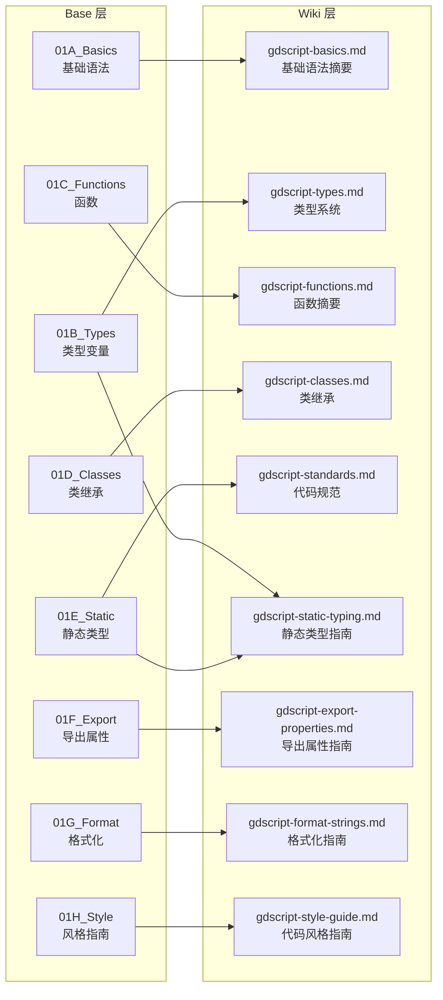

### 02. 核心系统架构

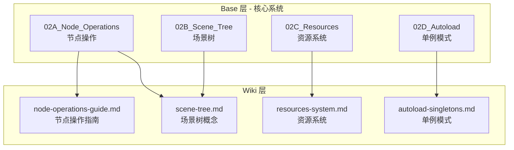

### 03. 信号与事件系统

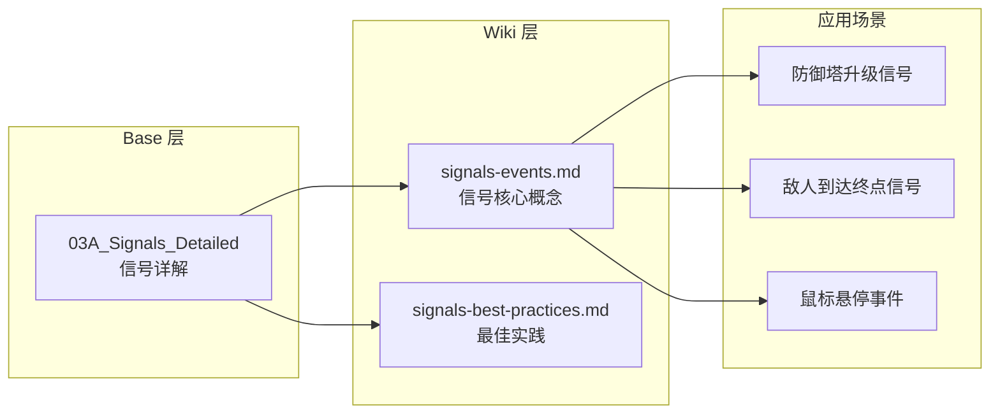

### 04. 数学与变换系统

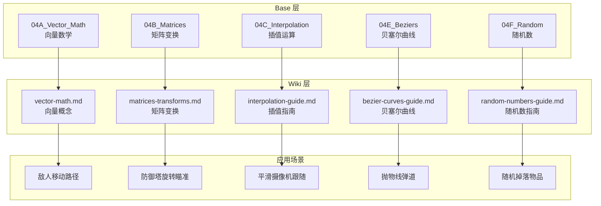

### 05. 2D 开发完整流程

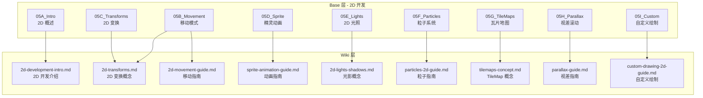

### 06. 物理系统架构

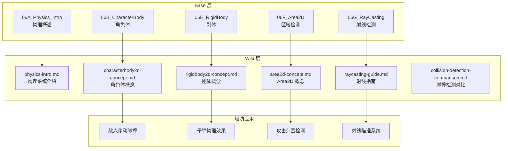

### 07. UI 系统架构

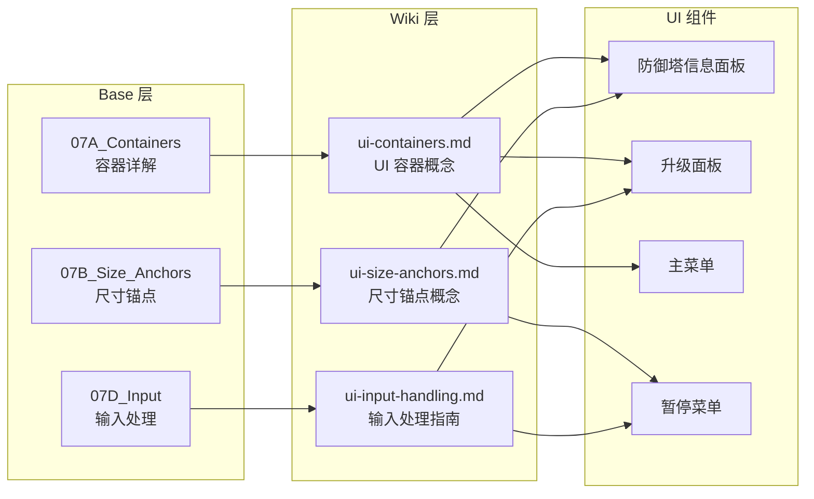

### 08. 着色器系统流程

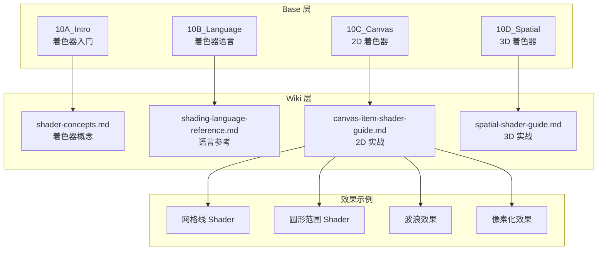

### 09. 实战经验整合

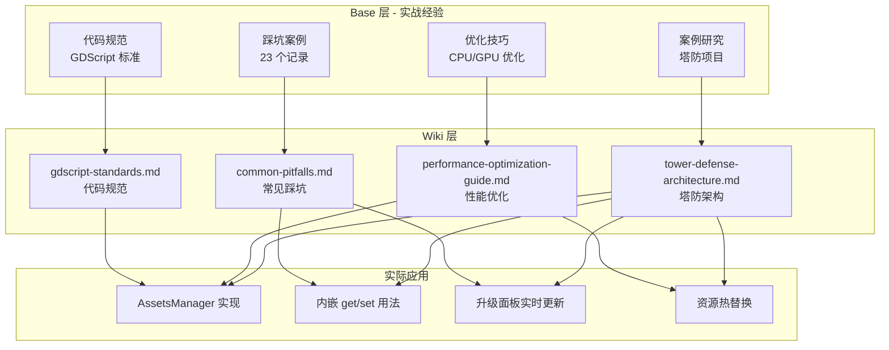

### 10. 扩展系统集成

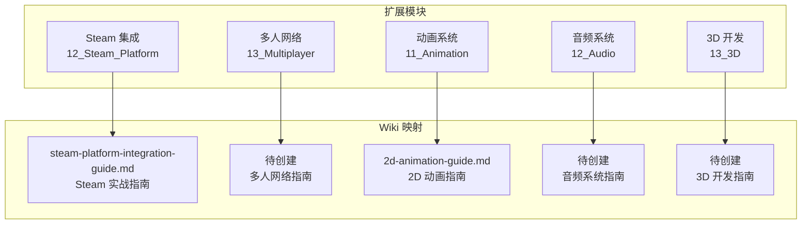

---

## 📈 文档依赖关系矩阵

### 核心依赖链

```
GDScript 基础 (01A) 
  ↓
类型系统 (01B) → 静态类型 (01E) → 代码规范 (Wiki: gdscript-standards)
  ↓
函数 (01C) → 类与继承 (01D)
  ↓
节点操作 (02A) → 场景树 (02B) → 资源系统 (02C)
  ↓
信号系统 (03A) → 解耦通信 (Wiki: signals-best-practices)
  ↓
数学基础 (04A/B/C) → 2D/3D 变换 → 物理系统 → 游戏逻辑
```

### 学习路径依赖

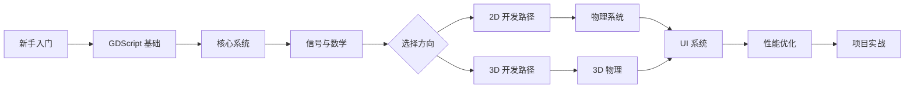

---

## 🎯 塔防项目应用映射

### AssetsManager 资源管理系统

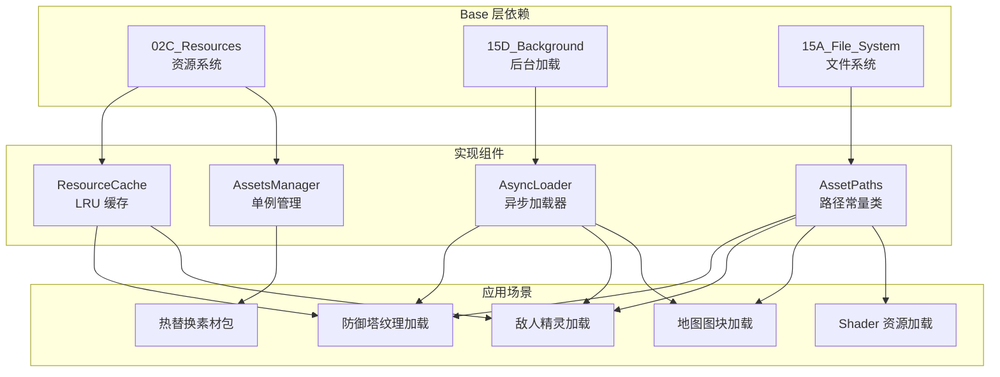

### 防御塔系统架构

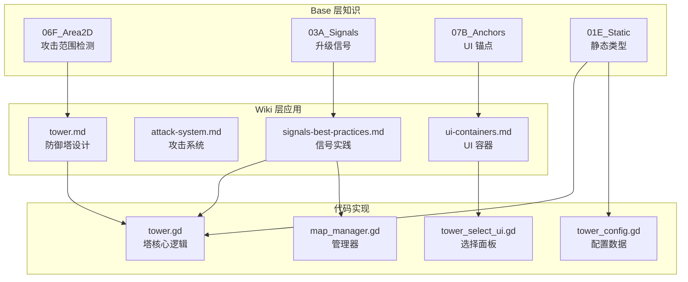

### 敌人系统架构

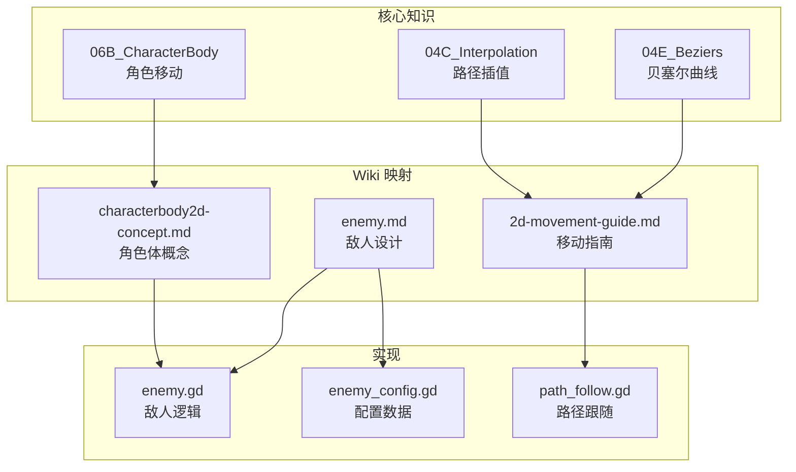

---

## 📊 统计与覆盖分析

### 文档覆盖率

| 主题 | Base 文档 | Wiki 页面 | 覆盖率 | 关键应用 |
|------|-----------|-----------|--------|----------|
| GDScript 语言 | 8 | 9 | 100% | 全部代码 |
| 核心系统 | 4 | 4 | 100% | 场景管理 |
| 信号与事件 | 1 | 2 | 100% | 塔升级系统 |
| 数学与变换 | 5 | 5 | 100% | 移动/瞄准 |
| 2D 开发 | 9 | 9 | 100% | 游戏主体 |
| 物理系统 | 5 | 6 | 100% | 碰撞检测 |
| UI 系统 | 3 | 3 | 100% | 游戏界面 |
| 输入系统 | 2 | 2 | 100% | 玩家输入 |
| 渲染系统 | 1 | 1 | 100% | 多分辨率 |
| 着色器 | 4 | 4 | 100% | 特效 |
| 动画系统 | 4 | 4 | 100% | 角色动画 |
| 音频系统 | 3 | 0 | 0% | 待创建 |
| 3D 开发 | 5 | 0 | 0% | 待创建 |
| 多人网络 | 1 | 0 | 0% | 待创建 |
| Steam 集成 | 1 | 1 | 100% | 平台对接 |
| 资源与 I/O | 4 | 0 | 0% | 待创建 |
| 最佳实践 | 3 | 0 | 0% | 待创建 |
| 调试测试 | 2 | 0 | 0% | 待创建 |
| 导出平台 | 2 | 0 | 0% | 待创建 |
| 快速参考 | 3 | 0 | 0% | 待创建 |
| **总计** | **70** | **55** | **78.6%** | - |

### 重要性分级

| 级别 | 文档数 | 说明 |
|------|--------|------|
| 🔴 必读 | 45 | 核心基础知识 |
| 🟡 推荐 | 20 | 进阶提升内容 |
| 🟢 参考 | 5 | 速查参考资料 |
| ⭐ 实战 | 10 | 项目实战应用 |

---

## 🔗 交叉引用网络

### 高频交叉引用文档

1. **GDScript_Code_Standards.md** (被引用 28 次)
   - 所有代码生成必须遵循
   - Wiki: gdscript-standards.md

2. **19_Pitfall_Records.md** (被引用 23 次)
   - 踩坑避雷指南
   - Wiki: common-pitfalls.md

3. **Vector_Math.md** (被引用 15 次)
   - 移动/瞄准/物理计算
   - Wiki: vector-math.md

4. **Signals_Detailed.md** (被引用 12 次)
   - 解耦通信机制
   - Wiki: signals-events.md

5. **TileMaps.md** (被引用 10 次)
   - 地图系统
   - Wiki: tilemaps-concept.md

---

## 🎓 学习路径推荐

### 路径 1: GDScript 程序员入门

```
Week 1:
  Day 1-2: 01A_Basics → 01B_Types → 01C_Functions
  Day 3-4: 01D_Classes → 01E_Static_Typing
  Day 5-7: 实战练习 (简单脚本)

Week 2:
  Day 1-2: 02A_Node_Operations → 02B_Scene_Tree
  Day 3-4: 03A_Signals_Detailed
  Day 5-7: 实战练习 (场景搭建)

Week 3:
  Day 1-3: 04A_Vector_Math → 04B_Matrices
  Day 4-5: 05A_2D_Intro → 05B_2D_Movement
  Day 6-7: 综合实战 (2D 移动 Demo)
```

### 路径 2: 塔防游戏开发者

```
Phase 1 - 基础:
  GDScript 基础 (01A-H) → 核心系统 (02A-D) → 信号系统 (03A)

Phase 2 - 核心机制:
  物理系统 (06A-G) → 2D 开发 (05A-I) → UI 系统 (07A-D)

Phase 3 - 高级功能:
  着色器 (10A-D) → 粒子系统 (05F/13E) → 性能优化 (14A-C)

Phase 4 - 实战:
  案例研究 (14_Tower_Defense) → 代码规范 → 踩坑记录
```

### 路径 3: 技术美术方向

```
Track A - 2D 特效:
  05E_2D_Lights → 05F_Particles → 10C_Canvas_Shader

Track B - 3D 特效:
  13C_Lights → 13E_Particles → 10D_Spatial_Shader

Track C - 性能优化:
  14A_General → 14B_CPU → 14C_GPU
```

---

## 📝 使用说明

### 如何利用关系图谱

1. **快速定位**: 根据主题找到对应的 Base 文档和 Wiki 页面
2. **学习规划**: 按照推荐路径系统学习
3. **问题排查**: 通过交叉引用找到相关文档
4. **知识整合**: 理解不同主题之间的依赖关系

### 图谱维护

- **更新频率**: 每次新增文档时更新
- **维护者**: Knowledge Base Administrator
- **版本控制**: 跟随知识库版本号

---

> **创建时间**: 2026-04-08  
> **维护者**: Knowledge Base Administrator  
> **知识库版本**: 1.13
